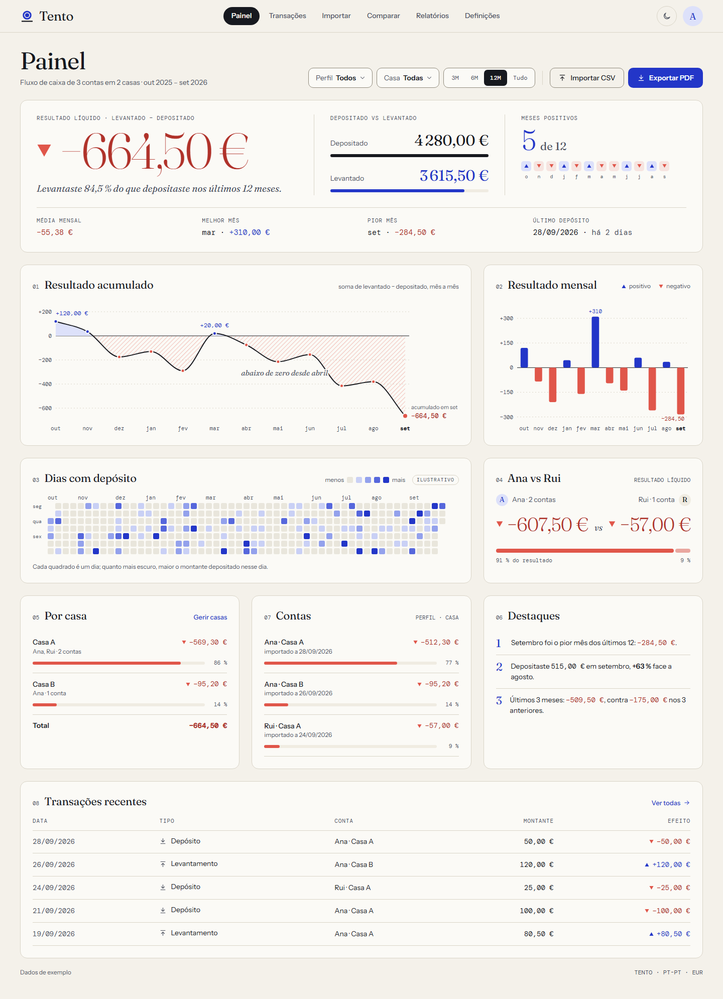

<div align="center">

<picture>
  <source media="(prefers-color-scheme: dark)" srcset="brand/logo-dark.png">
  
</picture>

**O fluxo de caixa das tuas contas nas casas de apostas — lido com a calma de um relatório.**

[](https://github.com/tpereira2005/tento/actions/workflows/ci.yml)


</div>

---

## O que é

O **Tento** importa os CSVs com os depósitos e levantamentos de cada conta (perfil × casa de apostas) e
mostra, sem rodeios, quanto entrou, quanto saiu e qual é o resultado líquido — por conta, por casa, por perfil
e ao longo do tempo.

> «Tento» é a ficha com que se contam os pontos de um jogo — e «ter tento» é ter juízo.

<p align="center">
  
</p>

## Funcionalidades

|                            |                                                                                                   |
| -------------------------- | ------------------------------------------------------------------------------------------------- |
| **Importação de CSV**      | Pré-visualização, erros por linha, deteção de duplicados e conflitos, desfazer um import          |
| **Painel**                 | Resultado líquido, depositado vs levantado, meses positivos, acumulado, mensal, dias com depósito |
| **Casas, perfis e contas** | Várias casas, vários perfis, comparação perfil vs perfil e casa vs casa                           |
| **Relatório PDF**          | Relatório com o design da marca, gerado no browser                                                |
| **Claro, escuro e móvel**  | O mesmo layout nos dois temas, pensado também para o telemóvel                                    |
| **Privacidade**            | Sem analytics nem recursos de terceiros; os dados reais nunca entram no repositório               |

## Estado

| Etapa | Âmbito                                                   | Estado |
| ----- | -------------------------------------------------------- | ------ |
| 0     | Fundações: ferramentas, CI, identidade, componentes base | ✅     |
| 1     | Núcleo de domínio: CSV, dinheiro, datas, estatísticas    | ✅     |
| 2     | Base de dados, API e autenticação                        | ✅     |
| 3     | Estrutura da aplicação e definições                      | ✅     |
| 4     | Importação                                               | ✅     |
| 5     | Painel                                                   | ✅     |
| 6     | Transações e Comparar                                    | ✅     |
| 7     | Relatório PDF                                            | ⏳     |
| 8     | Endurecimento e portabilidade                            | ⏳     |

Detalhe e critérios de "concluído" em [`docs/PLANO.md`](docs/PLANO.md).

## Começar

```bash
pnpm install
cp .env.example .env   # define BETTER_AUTH_SECRET (≥ 32 caracteres aleatórios)
pnpm db:migrate        # cria a base de dados local em data/tento.db
pnpm dev               # web em http://localhost:5173, API em http://localhost:8787
```

Para dados de demonstração (fictícios: Ana/Rui, Casa A/Casa B), define no `.env` as variáveis `DEMO_EMAIL` e
`DEMO_PASSWORD` (palavra-passe com pelo menos 12 caracteres; nunca a escrevas no código) e corre
`pnpm db:seed`. O registo público fecha depois de criado o primeiro utilizador.

| Comando      | Faz                                          |
| ------------ | -------------------------------------------- |
| `pnpm check` | lint, typecheck, formato, testes e build     |
| `pnpm test`  | testes unitários e de componentes (Vitest)   |
| `pnpm e2e`   | testes de ponta a ponta com Playwright e axe |
| `pnpm brand` | regenera logótipo e ícones                   |

## Stack

React 19 · Vite · TypeScript strict · TanStack Router e Query · Tailwind v4 · Radix ·
Hono · SQLite (Drizzle) · Better Auth · d3-shape · @react-pdf/renderer · Vitest · Playwright + axe.
Pensado para correr em Node ou em Cloudflare Workers sem alterações de código ([porquê](docs/DECISOES.md)).

## Documentação

- [`AGENTS.md`](AGENTS.md) — regras para quem trabalha no código (pessoas e agentes)
- [`docs/PLANO.md`](docs/PLANO.md) — plano por etapas
- [`docs/ARQUITETURA.md`](docs/ARQUITETURA.md) — arquitetura e portabilidade
- [`docs/DECISOES.md`](docs/DECISOES.md) — registo de decisões
- [`docs/design/`](docs/design) — identidade visual e mockups

## Licença

Projeto pessoal com código público para consulta. Sem licença de reutilização: todos os direitos reservados.
Os dados de exemplo (perfis «Ana» e «Rui», valores) são fictícios.
