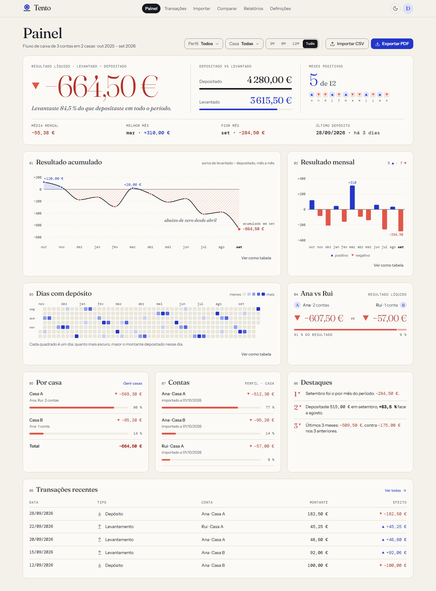
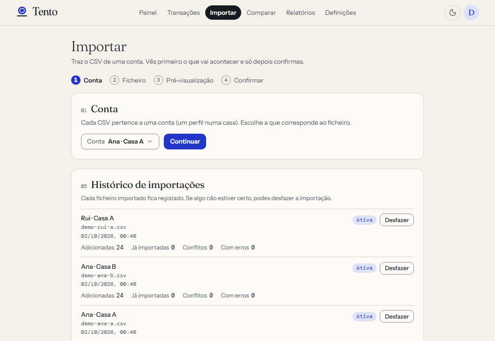
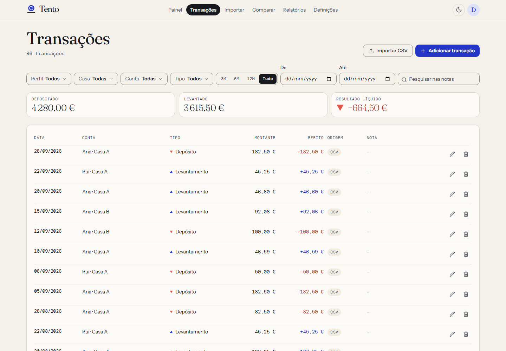
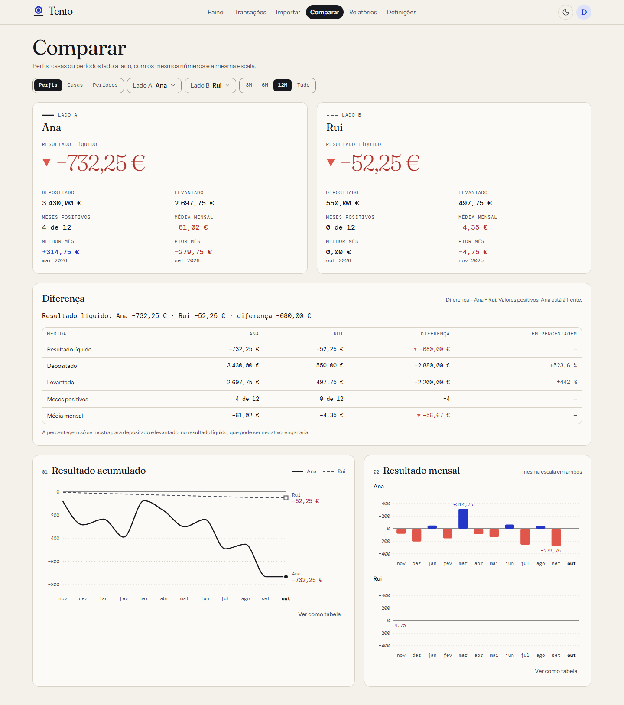
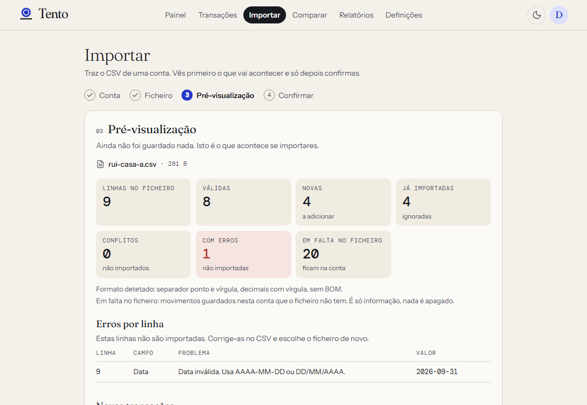
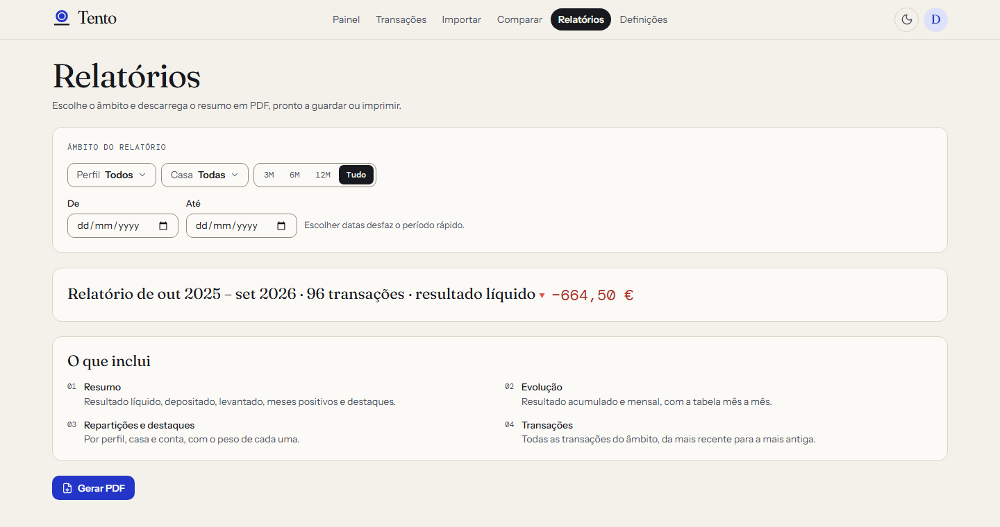
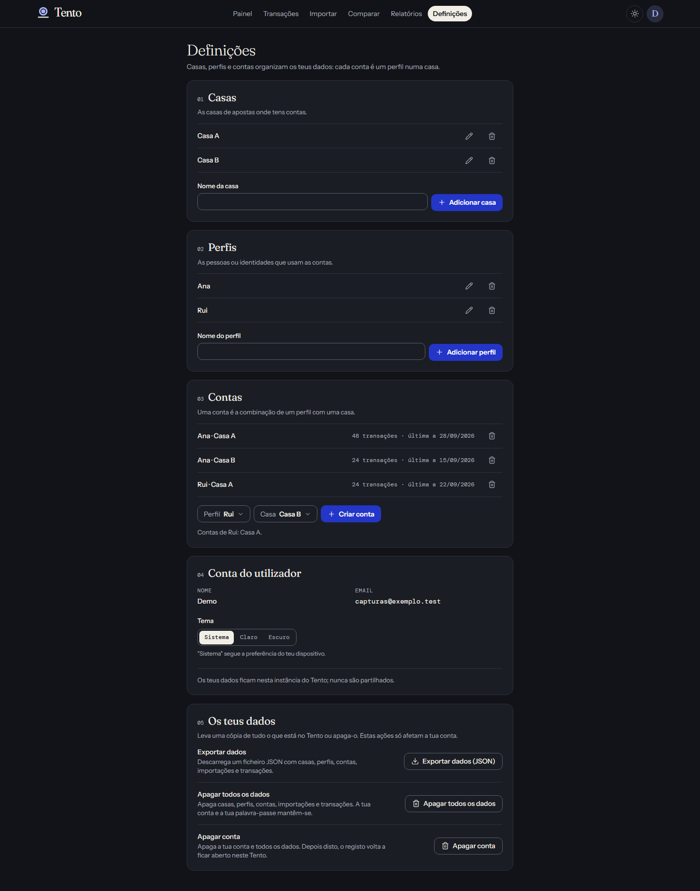
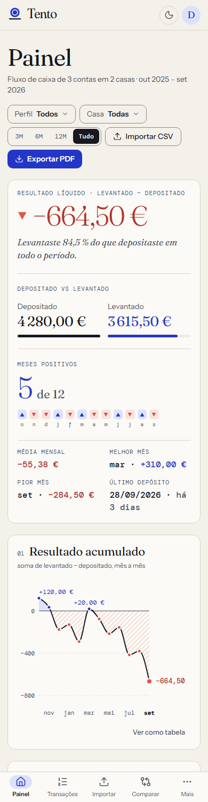

<div align="center">

<picture>
  <source media="(prefers-color-scheme: dark)" srcset="brand/logo-dark.png">
  
</picture>

**O fluxo de caixa das tuas contas nas casas de apostas — lido com a calma de um relatório.**

[](https://tento.tomaspereira.chatgpt.site)

[](https://github.com/tpereira2005/tento/actions/workflows/ci.yml)


</div>

---

## O que é

O **Tento** importa os CSVs com os depósitos e levantamentos de cada conta (perfil × casa de apostas) e
mostra, sem rodeios, quanto entrou, quanto saiu e qual é o resultado líquido — por conta, por casa, por perfil
e ao longo do tempo.

> «Tento» é a ficha com que se contam os pontos de um jogo — e «ter tento» é ter juízo.

<p align="center">
  <picture>
    <source media="(prefers-color-scheme: dark)" srcset="docs/screenshots/painel-escuro.png">
    
  </picture>
</p>

<p align="center"><sub>Todas as capturas usam dados de demonstração fictícios (perfis «Ana» e «Rui», «Casa A» e «Casa B»).</sub></p>

## Funcionalidades

|                            |                                                                                                   |
| -------------------------- | ------------------------------------------------------------------------------------------------- |
| **Importação de CSV**      | Pré-visualização, erros por linha, deteção de duplicados e conflitos, desfazer um import          |
| **Painel**                 | Resultado líquido, depositado vs levantado, meses positivos, acumulado, mensal, dias com depósito |
| **Casas, perfis e contas** | Várias casas, vários perfis, comparação perfil vs perfil e casa vs casa                           |
| **Relatório PDF**          | Relatório com o design da marca, gerado no browser                                                |
| **Os teus dados**          | Exportar tudo em JSON, apagar todos os dados ou apagar a conta, em Definições                     |
| **Segurança**              | CSP sem scripts inline, HSTS, sessões seguras e registo fechado depois do primeiro utilizador     |
| **Claro, escuro e móvel**  | O mesmo layout nos dois temas, pensado também para o telemóvel                                    |
| **Privacidade**            | Sem analytics nem recursos de terceiros; os dados reais nunca entram no repositório               |

## Capturas

### Importação

Pré-visualização antes de guardar nada: linhas novas, já importadas, conflitos e erros por linha.

<p align="center">
  
</p>

### Ecrãs

|                                                                                                           |                                                                                                                 |
| --------------------------------------------------------------------------------------------------------- | --------------------------------------------------------------------------------------------------------------- |
|  <br> **Transações** — filtros e totais               |  <br> **Comparar** — perfil vs perfil, com a mesma escala       |
|  <br> **Importar** — pré-visualização com contagens       |  <br> **Relatórios** — âmbito e PDF                         |
|  <br> **Definições** (tema escuro) — «Os teus dados» |  <br> **Telemóvel** — 390 px |

## Estado

| Etapa | Âmbito                                                   | Estado |
| ----- | -------------------------------------------------------- | ------ |
| 0     | Fundações: ferramentas, CI, identidade, componentes base | ✅     |
| 1     | Núcleo de domínio: CSV, dinheiro, datas, estatísticas    | ✅     |
| 2     | Base de dados, API e autenticação                        | ✅     |
| 3     | Estrutura da aplicação e definições                      | ✅     |
| 4     | Importação                                               | ✅     |
| 5     | Painel                                                   | ✅     |
| 6     | Transações e Comparar                                    | ✅     |
| 7     | Relatório PDF                                            | ✅     |
| 8     | Endurecimento e portabilidade                            | ✅     |

Versão atual: **v1.1.0** — ver o [`CHANGELOG.md`](CHANGELOG.md).

Detalhe e critérios de "concluído" em [`docs/PLANO.md`](docs/PLANO.md).

## Alojamento

[Tento publicado no ChatGPT Sites](https://tento.tomaspereira.chatgpt.site) (Cloudflare Workers + D1),
com audiência pública: abrir o site não exige uma conta ChatGPT nem uma lista de acesso. Os dados ficam
protegidos pelo login do Tento. O registo aceita apenas o email do dono configurado na plataforma.

Autenticação: email + palavra-passe (mínimo de 12 caracteres). O SIWC do Sites não disponibiliza no
contrato atual a integração OIDC e o email verificado exigidos para ligar contas no Better Auth (D-017).

Variáveis nas definições do Sites: `BETTER_AUTH_URL` (origem pública https, sem barra final),
`BETTER_AUTH_SECRET` (segredo aleatório, pelo menos 32 caracteres) e `OWNER_EMAIL` (email do dono).
`OWNER_EMAIL` é opcional no código, mas deve ser definido antes de publicar uma instância vazia:
só esse email poderá criar conta. O registo fecha depois da primeira conta.

Build: `pnpm build:sites`. Atualizações, migrações e rotação dos segredos em
[`docs/MIGRACAO.md`](docs/MIGRACAO.md).

## Desenvolvimento local

```bash
pnpm install
cp .env.example .env   # define BETTER_AUTH_SECRET (≥ 32 caracteres aleatórios)
pnpm db:migrate        # cria a base de dados local em data/tento.db
pnpm dev               # web em http://localhost:5173, API em http://localhost:8787
```

Para dados de demonstração (fictícios: Ana/Rui, Casa A/Casa B), define no `.env` as variáveis `DEMO_EMAIL` e
`DEMO_PASSWORD` (palavra-passe com pelo menos 12 caracteres; nunca a escrevas no código) e corre
`pnpm db:seed`. O registo público fecha depois de criado o primeiro utilizador.

| Comando           | Faz                                                          |
| ----------------- | ------------------------------------------------------------ |
| `pnpm check`      | lint, typecheck, formato, testes e build                     |
| `pnpm test`       | testes unitários e de componentes (Vitest)                   |
| `pnpm e2e`        | testes de ponta a ponta com Playwright e axe (servidor Node) |
| `pnpm e2e:worker` | a mesma suíte E2E contra Cloudflare Workers + D1 (`workerd`) |
| `pnpm worker:dev` | a app sobre Workers + D1 local (`wrangler dev`, porta 8787)  |
| `pnpm brand`      | regenera logótipo e ícones                                   |

Para o `pnpm worker:dev`, cria um ficheiro `.dev.vars` (ignorado pelo git) com `BETTER_AUTH_SECRET=...` (≥ 32
caracteres aleatórios) e `BETTER_AUTH_URL=http://localhost:8787`.

### Alojamento

O Tento corre em Node (SQLite/libSQL) ou em Cloudflare Workers + D1, sem alterar código. Passos, variáveis e
migração de dados em [`docs/MIGRACAO.md`](docs/MIGRACAO.md).

### Contribuir

`node scripts/social-preview.mjs` regenera `brand/social-preview.png` (1280×640, a imagem de pré-visualização
social do repositório); `pnpm brand` regenera o logótipo e os ícones. As capturas em `docs/screenshots/` são
feitas a partir da app real com dados de demonstração, nunca com dados reais.

## Stack

React 19 · Vite · TypeScript strict · TanStack Router e Query · Tailwind v4 · Radix ·
Hono · SQLite (Drizzle) · Better Auth · d3-shape · @react-pdf/renderer · Vitest · Playwright + axe.
Pensado para correr em Node ou em Cloudflare Workers sem alterações de código ([porquê](docs/DECISOES.md)).

## Documentação

- [`AGENTS.md`](AGENTS.md) — regras para quem trabalha no código (pessoas e agentes)
- [`docs/PLANO.md`](docs/PLANO.md) — plano por etapas
- [`docs/ARQUITETURA.md`](docs/ARQUITETURA.md) — arquitetura e portabilidade
- [`docs/DECISOES.md`](docs/DECISOES.md) — registo de decisões
- [`docs/MIGRACAO.md`](docs/MIGRACAO.md) — alojamento e migração (Node, Cloudflare Workers + D1)
- [`CHANGELOG.md`](CHANGELOG.md) — alterações por versão
- [`docs/design/`](docs/design) — identidade visual e mockups

## Licença

Projeto pessoal com código público para consulta. Sem licença de reutilização: todos os direitos reservados.
Os dados de exemplo (perfis «Ana» e «Rui», valores) são fictícios.
